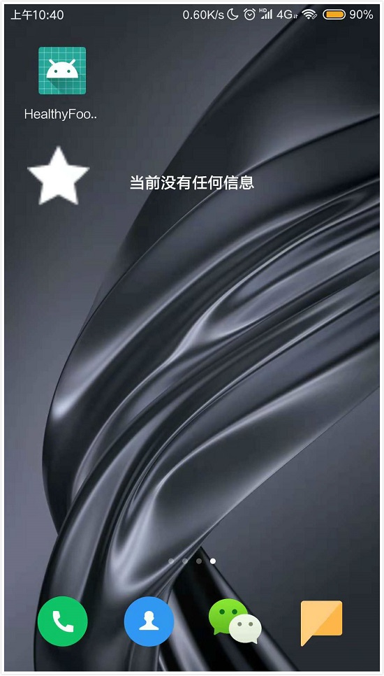
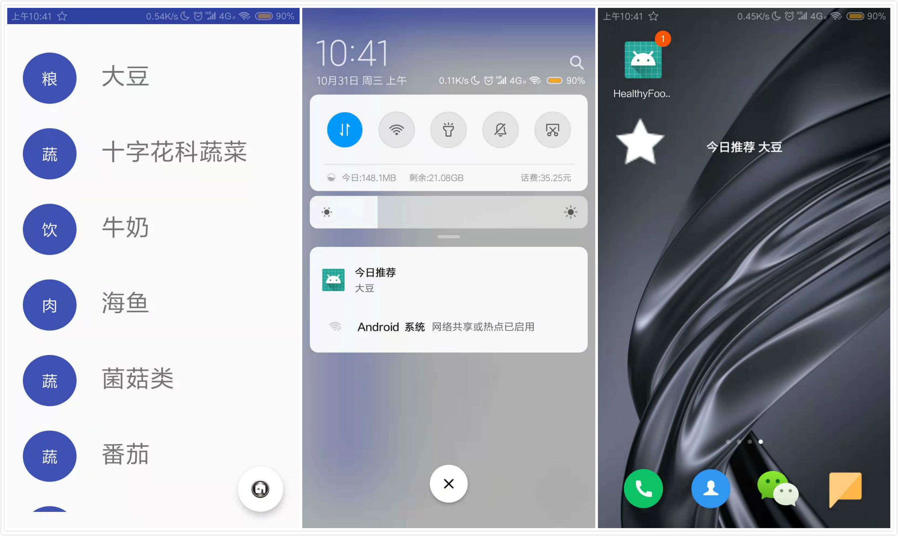
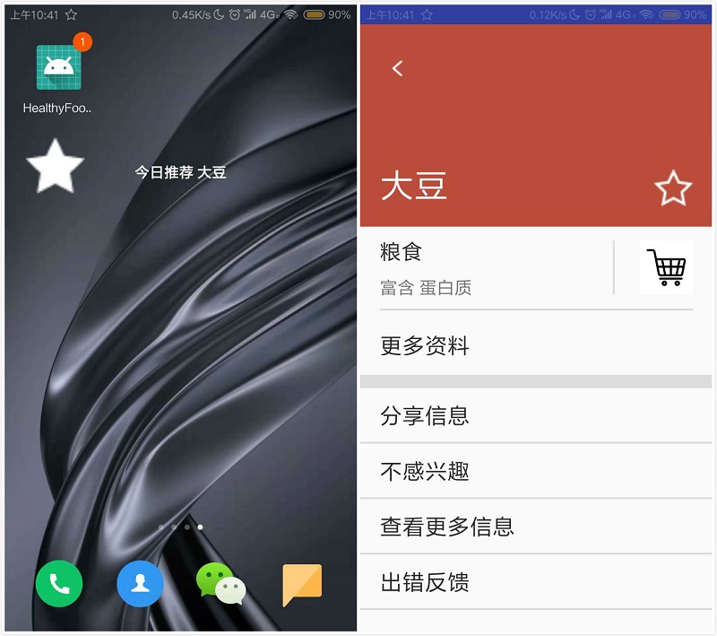
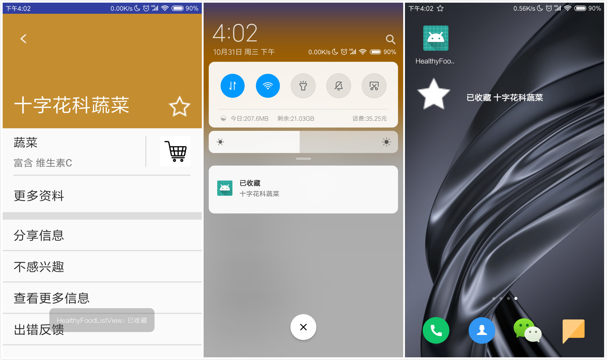
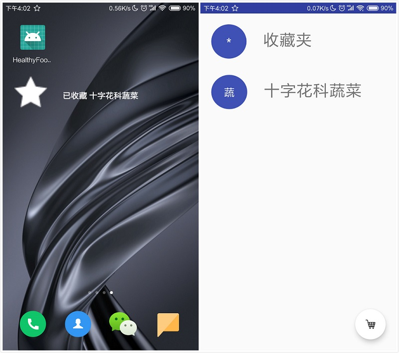

# 中山大学数据科学与计算机学院本科生实验报告

## （2018年秋季学期）

| 课程名称 | 手机平台应用开发 | 任课老师 | 郑贵锋 |
| :------------: | :-------------: | :------------: | :-------------: |
| 年级 | 2016级  | 专业（方向） |  计算机应用 |
| 学号 | 16340030 | 姓名 | 陈斯敏 |
| 电话 | 15917173057 | Email | 2540740154@qq.com |
| 开始日期 | 2018.10.26 | 完成日期 | 2018.10.30

---

## 一、实验题目

### **个人项目2**

### **中山大学智慧健康服务平台应用开发**

#### 第八周任务: **AppWidget 使用**

---

## 二、实验目的

### 1. 复习 Broadcast 编程基础。
### 2. 复习动态注册 Broadcast 和静态注册 Broadcast 。
### 3. 掌握 AppWidget 编程基础。

---


## 三、实现内容

### 实验内容
在第七周任务的基础上，实现静态广播、动态广播两种改变widget内容的方法。  

#### 要求 
* widget初始情况如下：      
 
* 点击widget可以启动应用，并在widget随机推荐一个食品。      

* 点击widget跳转到所推荐食品的详情界面。     
 
* 点击收藏图标，widget相应更新。     
 
* 点击widget跳转到收藏列表。     
 
* 实现方式要求:启动时的widget更新通过静态广播实现，点击收藏图标时的widget更新通过动态广播实现。  
 

---

## 四、实验结果

### (1) 实验截图
* 初次安装，未启动过，Widget显示“当前没有任何信息”：



* 点击Widget的star图标启动应用并发送今日推荐到Widget中：



* 点击显示有“今日推荐”的widget的star图标跳转到所推荐食品的详情界面。
 


* 点击收藏图标，widget相应更新。



* 点击widget跳转到收藏列表。




---
### (2) 实验步骤以及关键代码
* 首先在 Android Studio 中创建 Widget 类: File -> New -> Widget。编辑new_app_widget_info.xml 文件，设置其大小属性和布局，如下:
    ```xml
    <appwidget-provider xmlns:android="http://schemas.android.com/apk/res/android"
        android:initialKeyguardLayout="@layout/new_app_widget"
        android:initialLayout="@layout/new_app_widget"
        android:minWidth="300dp"
        android:minHeight="50dp"
        android:previewImage="@mipmap/full_star"
        android:resizeMode="horizontal|vertical"
        android:updatePeriodMillis="86400000"
        android:widgetCategory="home_screen|keyguard"></appwidget-provider>
    ```
* 设计widget的布局文件，布局中有一个ImageView，一个TextView，所以，最后的new_app_widget.xml如下所示：
    ```xml
    <RelativeLayout xmlns:android="http://schemas.android.com/apk/res/android"
        android:layout_width="match_parent"
        android:layout_height="match_parent"
        android:background="@android:color/transparent"
        android:padding="@dimen/widget_margin">
        <ImageView
            android:id="@+id/widget_image"
            android:layout_width="60dp"
            android:layout_height="60dp"
            android:src="@drawable/full_star"/>

        <TextView
            android:id="@+id/appwidget_text"
            android:layout_width="wrap_content"
            android:layout_height="wrap_content"
            android:layout_centerHorizontal="true"
            android:layout_centerVertical="true"
            android:layout_marginLeft="8dp"
            android:contentDescription="@string/appwidget_text"
            android:text="当前没有任何信息"
            android:textColor="#ffffff"
            android:textSize="15sp"
            android:textStyle="bold" />

    </RelativeLayout>
    ```
* 修改NewAppWidget.java 代码，重写 onUpdate 方法，为 Widget 添加事件，使得点击能够启动应用。：
    ```java
    @Override
    public void onUpdate(Context context, AppWidgetManager appWidgetManager, int[] appWidgetIds) {
        // There may be multiple widgets active, so update all of them
        for (int appWidgetId : appWidgetIds) {
            updateAppWidget(context, appWidgetManager, appWidgetId);
        }
        RemoteViews updateView = new RemoteViews(context.getPackageName(), R.layout.new_app_widget);//实例化RemoteView,其对应相应的Widget布局
        Intent i = new Intent(context, MainActivity.class);
        PendingIntent pi = PendingIntent.getActivity(context, 0, i, PendingIntent.FLAG_UPDATE_CURRENT);
        updateView.setOnClickPendingIntent(R.id.widget_image, pi); //设置点击事件
        ComponentName me = new ComponentName(context, NewAppWidget.class);
        appWidgetManager.updateAppWidget(me, updateView);
    }
    ```
* 在AndroidMainfest.xml 中进行注册Widget静态广播。
    ```xml
    <receiver android:name=".NewAppWidget">
        <intent-filter>
            <action android:name="android.appwidget.action.APPWIDGET_UPDATE" />
            <action android:name="com.example.hasee.myapplication2.MyWidgetStaticFilter" />
        </intent-filter>

        <meta-data
            android:name="android.appwidget.provider"
            android:resource="@xml/new_app_widget_info" />
    </receiver>
    ```
* 在NewAppWidget.java 文件的Widget 类中重写onReceive 方法，这里需要使用到RemoteView 以及Bundle。当接收到对应广播时进行数据处理。
    ```java
    @Override
    public void onReceive(Context context, Intent intent){
        super.onReceive(context, intent);
        AppWidgetManager appWidgetManager = AppWidgetManager.getInstance(context);
        if(intent.getAction().equals(WIDGETSTATICACTION)){

            Bundle bundle = intent.getExtras();
            Collection collection = (Collection) bundle.get("data");
            RemoteViews views = new RemoteViews(context.getPackageName(), R.layout.new_app_widget);
            views.setTextViewText(R.id.appwidget_text, "今日推荐 " + collection.getName());
            views.setImageViewResource(R.id.widget_image, R.drawable.full_star);
            Intent mIntent = new Intent(context, DetailActivity.class).setAction(WIDGETSTATICACTION);
            Bundle bundles = new Bundle();
            bundles.putSerializable("data", collection);
            mIntent.putExtras(bundles);
            PendingIntent pendingIntent = PendingIntent.getActivity(context, 0, mIntent, PendingIntent.FLAG_CANCEL_CURRENT);
            views.setOnClickPendingIntent(R.id.widget_image,pendingIntent);
            ComponentName me = new ComponentName(context, NewAppWidget.class);
            appWidgetManager.updateAppWidget(me, views);
        }
    }
    ```
* 在NewAppWidget.java 文件的Widget 类中修改 updateAppWidget 方法，设置初始text和图片等，初始text为“当前没有任何消息”：
    ```java
    static void updateAppWidget(Context context, AppWidgetManager appWidgetManager,
                                int appWidgetId) {
        // Construct the RemoteViews object
        RemoteViews views = new RemoteViews(context.getPackageName(), R.layout.new_app_widget);
        views.setTextViewText(R.id.appwidget_text, "当前没有任何信息");
        views.setImageViewResource(R.id.widget_image, R.drawable.full_star);
        Intent mIntent = new Intent(context, MainActivity.class).setAction(WIDGETSTATICACTION);
        PendingIntent pendingIntent = PendingIntent.getActivity(context, 1000, mIntent, PendingIntent.FLAG_UPDATE_CURRENT);
        views.setOnClickPendingIntent(R.id.widget_image, pendingIntent);
        // Instruct the widget manager to update the widget
        appWidgetManager.updateAppWidget(appWidgetId, views);
    }
    ```
* 在MainActivity应用启动时，发送widget静态广播，这里的发送widget静态广播和上周的静态广播放在一块儿，写在sendStaticBroadcast 函数中，并在OnCreate函数中进行调用，sendStaticBroadcast 函数如下所示：
    ```java
    protected void sendStaticBroadcast() {
        // 随机获取一个数据放入bundle
        Random random = new Random();
        randomNum = random.nextInt(data.size());
        Bundle bundle = new Bundle();
        bundle.putSerializable("data", data.get(randomNum - 1));
        // 发送静态广播
        Intent intentBroadcast = new Intent(StaticReceiver.STATICACTION);
        intentBroadcast.putExtras(bundle);
        intentBroadcast.setComponent(new
                ComponentName(
                    getPackageName(),
                getPackageName() + ".StaticReceiver"
        ));
        sendBroadcast(intentBroadcast);
        // 发送Widget静态广播
        Intent widgetIntentBroadcast = new Intent();
        widgetIntentBroadcast.setAction(NewAppWidget.WIDGETSTATICACTION);
        widgetIntentBroadcast.putExtras(bundle);
        widgetIntentBroadcast.setComponent(new
                ComponentName(
                getPackageName(),
                getPackageName() + ".NewAppWidget"
        ));
        sendBroadcast(widgetIntentBroadcast);
    }
    ```
* 修改上周的动态广播类 DynamicReceiver，在onReceive函数中，加上修改widget中text的内容为已修改，最终，该DynamicReceiver函数如下：
    ```java
    @Override
    public void onReceive(Context context, Intent intent) {
        if (intent.getAction().equals(DYNAMICACTION)) {    //动作检测
            Bundle bundle = intent.getExtras();
            Collection collection = (Collection) bundle.get("data");

            String channelName = "another_healthy_channel";//渠道名字
            String channelId = "16340030"; // 渠道ID
            String channelDescrption = "I_am_another_healthy_channel";
            NotificationChannel channel = new NotificationChannel(channelId, channelName, NotificationManager.IMPORTANCE_LOW);
            channel.setDescription(channelDescrption);
            NotificationManager manager = (NotificationManager)context.getSystemService(Context.NOTIFICATION_SERVICE);
            manager.createNotificationChannel(channel);
            // 实现notification提示已收藏
            Intent mIntent = new Intent(context, MainActivity.class).setAction(DYNAMICACTION);
            PendingIntent pendingIntent = PendingIntent.getActivity(context, id, mIntent, PendingIntent.FLAG_UPDATE_CURRENT);
            Notification.Builder builder = new Notification.Builder(context, channelId);
            builder.setContentTitle("已收藏")   //设置通知栏标题：发件人
                    .setContentText(collection.getName())   //设置通知栏显示内容：短信内容
                    .setTicker("您有一条新消息")   //通知首次出现在通知栏，带上升动画效果的
                    .setSmallIcon(R.mipmap.empty_star)   //设置通知小ICON（通知栏）
                    .setContentIntent(pendingIntent)   //传递内容
                    .setAutoCancel(true); //点击通知头自动取消
            Notification notification = builder.build();
            manager.notify(id, notification);
            id++;
            // 实现widget修改text为已收藏
            AppWidgetManager appWidgetManager = AppWidgetManager.getInstance(context);
            RemoteViews views = new RemoteViews(context.getPackageName(), R.layout.new_app_widget);
            views.setTextViewText(R.id.appwidget_text, "已收藏 " + collection.getName());
            views.setImageViewResource(R.id.widget_image, R.drawable.full_star);
            Intent mIntent2 = new Intent(context,MainActivity.class).setAction(DYNAMICACTION);
            Bundle bundles = new Bundle();
            bundles.putSerializable("data", collection);
            mIntent.putExtras(bundles);
            PendingIntent pendingIntent2 = PendingIntent.getActivity(context, id, mIntent2, PendingIntent.FLAG_CANCEL_CURRENT);
            views.setOnClickPendingIntent(R.id.widget_image,pendingIntent2);
            ComponentName me = new ComponentName(context, NewAppWidget.class);
            appWidgetManager.updateAppWidget(me, views);
            id++;
        }
    }
    ```
* 在详情页面DetailActivity 中，在onCreate函数中,注册动态广播：
    ```java
    //添加动态广播的Action
    IntentFilter dynamic_filter = new IntentFilter();
    dynamic_filter.addAction(DynamicReceiver.DYNAMICACTION);
    DynamicReceiver dynamicReceiver = new DynamicReceiver();
    registerReceiver(dynamicReceiver, dynamic_filter);    //注册自定义动态广播消息
    ```
* 在详情页面DetailActivity 中，收藏按钮的点击函数中发送动态广播，发送动态广播的函数sendDynamicBroadcast如下：
    ```java
    protected void sendDynamicBroadcast() {
        Bundle bundle = new Bundle();
        bundle.putSerializable("data", collection);
        // 发送动态广播
        Intent intentBroadcast = new Intent(DynamicReceiver.DYNAMICACTION);
        intentBroadcast.putExtras(bundle);
        sendBroadcast(intentBroadcast);
    }
    ```
---

### (3) 实验遇到的困难以及解决思路
#### 问题一：我的手机版本是安卓8.0以上的，编写StaticReceiver时，发现MainActivity中调用sendBroadcast之后，并没有接收到这个广播。
解决：经过查询资料，发现安卓8.0之后，不再接受不确定具体目标的广播（为了节省手机资源），所以要使用上下文注册的BroadCast，解决代码如下：
```java
    intentBroadcast.setComponent(new
            ComponentName(
                getPackageName(),
            getPackageName() + ".StaticReceiver"
    ));
    sendBroadcast(intentBroadcast);
```
#### 问题二：点击收藏图标之后，产生了notification，但是widget上没有改变（还是“今日推荐”，没有变到“已收藏”）。
解决：在DynamicRecevier中，notification 和 widget 所使用的 PendingIntent 的 id 相同，导致只被接收了一次，所以将他们的id修改一下便可以了。
```java
    private int id = 1;
    @Override
    public void onReceive(Context context, Intent intent) {
        if (intent.getAction().equals(DYNAMICACTION)) {    //动作检测
            ......
            PendingIntent pendingIntent = PendingIntent.getActivity(context, id, mIntent, PendingIntent.FLAG_UPDATE_CURRENT);
            ......
            manager.notify(id, notification);
            id++;
            // 实现widget修改text为已收藏
            ......
            PendingIntent pendingIntent2 = PendingIntent.getActivity(context, id, mIntent2, PendingIntent.FLAG_CANCEL_CURRENT);
            ......
            id++;
        }
    }
}
```
#### 问题三：点击收藏按钮可能会发出多条动态广播通知（第一次一条，第二次2条，第三次3条）
解决：动态广播的注册写错了地方，放在点击收藏按钮函数里边，导致每点击一次2，就注册一个然后发一条信息，之后会注册多个，便会发送多个notification，所以将它写在DetailActivity的OnCreate函数便可以解决。
```java
@Override
protected void onCreate(Bundle savedInstanceState) {
    super.onCreate(savedInstanceState);
    setContentView(R.layout.detail);
    // 接收数据
    Bundle bundle = getIntent().getExtras();
    collection = (Collection) bundle.get("data");
    collection.setIs_collected(false);
    fullStar = false;
    Init();
    //添加动态广播的Action
    IntentFilter dynamic_filter = new IntentFilter();
    dynamic_filter.addAction(DynamicReceiver.DYNAMICACTION);
    DynamicReceiver dynamicReceiver = new DynamicReceiver();
    registerReceiver(dynamicReceiver, dynamic_filter);    //注册自定义动态广播消息
}
```

---

## 五、实验思考及感想

#### 有了上周对Broadcast编程基础的了解和实现，这周的作业实现起来并不复杂，基本跟上周差别不大， AppWidget 的实现跟 Broadcast接收器很相似，所以也就比较快地解决了问题，遇到的困难也能比较快地解决，收获如下：
#### 1. 了解了Broadcast编程的一些内容，掌握安卓的广播编程基础。
#### 2. 掌握了动态注册 Broadcast 和静态注册 Broadcast。
#### 3. 掌握 AppWidget 编程基础。
#### 4. 遇到某些版本问题的bug，官方文档正常都是会给出解释的，所以需要积极查阅文档。
#### 5. 学会使用AS生成apk安装包，在自己的手机上安装（这个收获也是由于某个bug学会的，当安卓调试时，把软件卸载了，后面可能导致一直点击 run 安装不上，所以需要手动生成apk来安装）。


---
